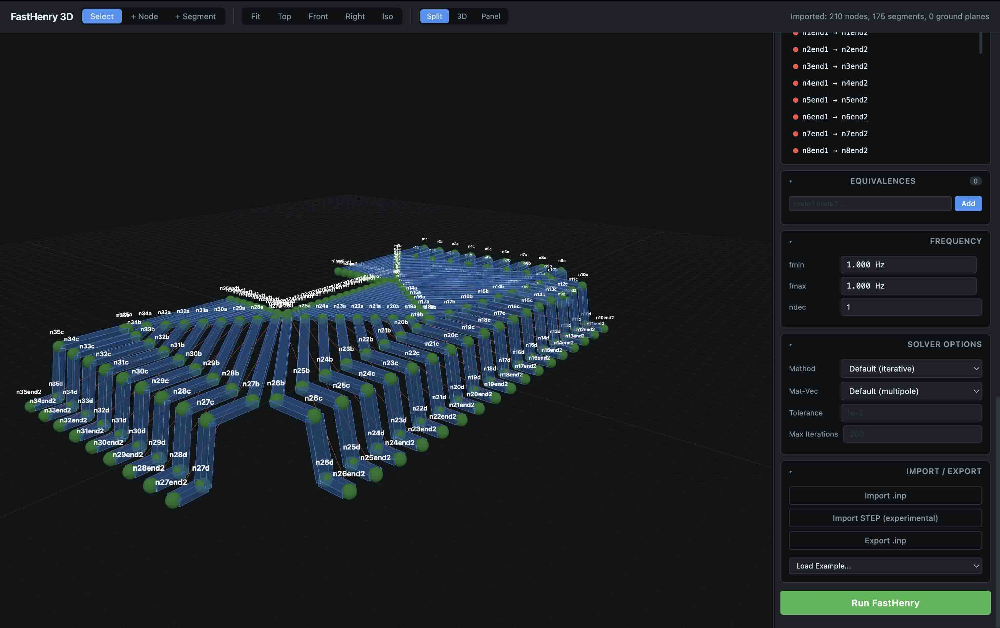
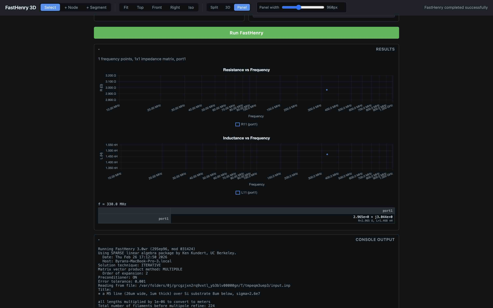

# FastHenry Inductance Simulation GUI

FastHenry extracts pure inductance, frequency-dependent self + mutual inductances, resistances between conductors of 3D bodies.

This repository contains the 3.0wr branch from Whiteley Research which extends the original MIT release with superconductor support, modern improvements. A ***vibe-coded*** web-based 3D GUI is appended by myself.




## Web-Based 3D GUI

- GPU-instanced rendering
- Visual model building
- STEP/CAD import (experimental)
- Results visualization

## Quick Start

### Build FastHenry

```bash
# Configure for your platform (default works for most Linux/macOS systems)
./config default

# Build the solver
make all

# The binary is placed in bin/
bin/fasthenry --version
```

Platform-specific configurations: `default`, `mingw` (Windows), `solaris`, `sgi`, `dec`, `alpha`, `sysV`.

For alternative linear algebra backends:

```bash
# KLU (requires SuiteSparse installed)
make SOLVER=KLU_SOLVER all

# Intel MKL/DSS
make SOLVER=DSS_SOLVER all
```

### Run the Web GUI

```bash
cd gui

# Install Python dependencies
pip install -r requirements.txt

pip install cadquery # Optional: install CadQuery for STEP import support

# Start the server
python server.py # web GUI hosted at localhost:5000
```

### Command-Line Usage

```bash
# Run a simulation directly
bin/fasthenry examples/input/pin-con7.inp

# Output is written to Zc.mat in the working directory
cat Zc.mat
```

## GUI Usage Guide

### Viewport Controls

| Action | Control |
|--------|---------|
| Orbit | Right-click drag |
| Pan | Middle-click drag |
| Zoom | Scroll wheel |
| Fit all | Press **F** or click **Fit** |
| Deselect | Press **Escape** |

### Building a Model

1. **Add Nodes** — Click the **+ Node** toolbar button, then click on the grid to place nodes. Or enter coordinates in the sidebar.
2. **Add Segments** — Click **+ Segment**, then click two nodes to connect them.
3. **Configure** — Set units, default cross-section dimensions (`w`, `h`), conductivity, and discretization in the Configuration panel.
4. **Ground Planes** — Define 3 corners, thickness, and segmentation counts.
5. **External Ports** — Select node pairs to define measurement ports.
6. **Frequency** — Enter sweep range using engineering notation (e.g., `10 kHz` to `100 MHz`).
7. **Run** — Click **Run FastHenry** to execute the simulation.

### Importing Files

- **Import .inp** — Load existing FastHenry input files
- **Import STEP** — Import 3D CAD files (requires `cadquery` or `gmsh` Python packages)
- **Examples** — Select from 24 built-in examples via the dropdown

## Credits & Acknowledgments

FastHenry was created at the Research Laboratory of Electronics, Department of Electrical Engineering and Computer Science, Massachusetts Institute of Technology, Cambridge, MA. This branch was created and maintained by Stephen R. Whiteley of Whiteley Research Inc. with further features as listed in `CHANGELOG`.

MIT License
